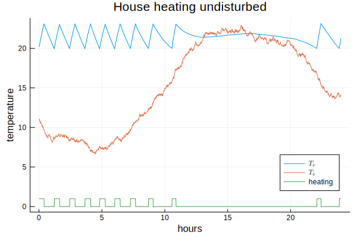
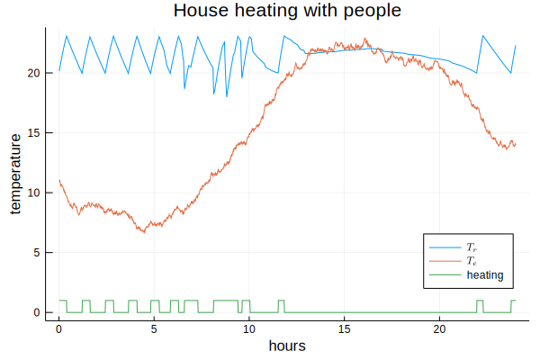

# House heating

In a hybrid system we have continuous processes and discrete events interacting in one system. A thermostat is a basic example of this:

- Heating changes between two states: On and Off.
- A room cools ``\dot{Q_c}\; [J/h]`` at a certain rate proportional to the difference between room temperature ``T_r`` and environment temperature ``T_e\; [K]``.
- It heats ``\dot{Q_h}\; [J/h]`` at a rate proportional to the temperature difference between temperature of the heating fluid ``T_h\; [K]`` and room temperature ``T_r\; [K]``.
- The room temperature ``T_r`` changes proportional to the difference between heating ``\dot{Q_h}`` and cooling ``\dot{Q_c}``.

```math
\begin{eqnarray}
\dot{Q_c} & = & \frac{\left(T_r - T_e\right)}{\eta R} \; & \left[\tfrac{J}{h}\right], & \mathrm{where\; R = thermal\ resistance\; \left[\tfrac{K h}{J}\right],\; \eta = efficiency\  factor \le 1.0}\\
\dot{Q_h} & = & \alpha \left(T_h - T_r\right) \; & \left[\tfrac{J}{h}\right], & \mathrm{where\; \alpha = proportionality\ factor}\; \left[\tfrac{J}{K h}\right] \\
\dot{T_h} & = & \beta \left(\dot{Q_h} - \dot{Q_c}\right)\; & \left[\tfrac{K}{h}\right], & \mathrm{where\; \beta = proportionality\ factor}\; \left[\tfrac{K}{J}\right]\\
\dot{T_c} & = & - \beta\ \dot{Q_c}\; & \left[\tfrac{K}{h}\right], & \mathrm{when\ heating\ is\ switched\ off.}
\end{eqnarray}
```

We assume that
- the thermostat is set to switch heating on if ``T_r`` falls under 20°C and to switch heating off if ``T_r`` rises above 23°C,
- time units are hours,
- the temperature ``T_h`` of the heating fluid is 40°C,
- the temperature ``T_e`` of the environment follows a stochastic process based on a sine function between 8 and 20°C with ``T_{e,min}`` at 4am and ``T_{e,max}`` at 4pm,
- the constants have values ``R = 1\times10^{-6}\ \left[\frac{K h}{J}\right],\; \alpha = 2\times 10^6\ \left[\frac{J}{K h}\right],\; \beta = 3\times 10^{-7}\; \left[\frac{K}{J}\right]``,
- people entering the room may reduce insulation efficiency by a factor ``\eta\le1.0`` to ``R``,
- the room temperature is initially ``T_{r,0} = 20 °C`` and
- the heater is off.

First we setup the physical model:


```julia
using Simulate, Plots, DataFrames, Random, Distributions, LaTeXStrings

const Th = 40     # temperature of heating fluid
const R = 1e-6    # thermal resistance of room insulation
const α = 2e6     # represents thermal conductivity and capacity of the air
const β = 3e-7    # represents mass of the air and heat capacity
η = 1.0           # efficiency factor reducing R if doors or windows are open
heating = false

Δte(t, t1, t2) = cos((t-10)*π/12) * (t2-t1)/2  # change of a sinusoidal Te

function Δtr(Tr, Te, heating)                  
    Δqc = (Tr - Te)/(R * η)                    # cooling rate
    Δqh = heating ? α * (Th - Tr) : 0          # heating rate
    return β * (Δqh - Δqc)                     # change in room temperature
end
```
Δtr (generic function with 1 method)


We now setup a simulation for 24 hours from 0am to 12am. We update the simulation every virtual minute.


```julia
reset!(𝐶)                                      # reset the clock
rng = MersenneTwister(122)                     # seed the random number generator
Δt = 1//60                                     # update every minute
Te = 11                                        # start value for environment temperature
Tr = 20                                        # start value for room temperature
df = DataFrame(t=Float64[], tr=Float64[], te=Float64[], heating=Int64[])

function setTemperatures(t1=8, t2=20)               # change the temperatures
    global Te += Δte(tau(), t1, t2) * 2π/1440 + rand(rng, Normal(0, 0.1))
    global Tr += Δtr(Tr, Te, heating) * Δt
    push!(df, (tau(), Tr, Te, Int(heating)) )       # append stats to the table
end

function switch(t1=20, t2=23)                       # simulate the thermostat
    if Tr ≥ t2
        global heating = false
        event!(SF(switch, t1, t2), @val :Tr :≤ t1)  # setup a conditional event
    elseif Tr ≤ t1
        global heating = true
        event!(SF(switch, t1, t2), @val :Tr :≥ t2)  # setup a conditional event
    end
end

Simulate.sample!(SF(setTemperatures), Δt)           # setup sampling
switch()                                            # start the thermostat

@time run!(𝐶, 24)
```
0.040105 seconds (89.21 k allocations: 3.435 MiB)\
"run! finished with 0 clock events, 1440 sample steps, simulation time: 24.0"


```julia
plot(df.t, df.tr, legend=:bottomright, label=L"T_r")
plot!(df.t, df.te, label=L"T_e")
plot!(df.t, df.heating, label="heating")
xlabel!("hours")
ylabel!("temperature")
title!("House heating undisturbed")
```





In a living room the thermal resistance is repeatedly diminished if people enter the room or open windows.


```julia
function people()
    delay!(6 + rand(Normal(0, 0.5)))         # sleep until around 6am
    sleeptime = 22 + rand(Normal(0, 0.5))    # calculate bed time
    while tau() < sleeptime
        global η = rand()                    # open door or window
        delay!(0.1 * rand(Normal(1, 0.3)))   # for some time
        global η = 1.0                       # close it again
        delay!(rand())
    end
end

reset!(𝐶)                                    # reset the clock
rng = MersenneTwister(122)
Random.seed!(1234)
Te = 11
Tr = 20
df = DataFrame(t=Float64[], tr=Float64[], te=Float64[], heating=Int64[])

for i in 1:2                                 # put 2 people in the house
    process!(SP(i, people), 1)               # run process only once
end
Simulate.sample!(SF(setTemperatures), Δt)    # set sampling function
switch()                                     # start the thermostat

@time run!(𝐶, 24)
```
0.114938 seconds (72.52 k allocations: 2.320 MiB)\
"run! finished with 116 clock events, 1440 sample steps, simulation time: 24.0"


```julia
plot(df.t, df.tr, legend=:bottomright, label=L"T_r")
plot!(df.t, df.te, label=L"T_e")
plot!(df.t, df.heating, label="heating")
xlabel!("hours")
ylabel!("temperature")
title!("House heating with people")
```





We have now all major schemes: events, continuous sampling and processes combined in one example.
