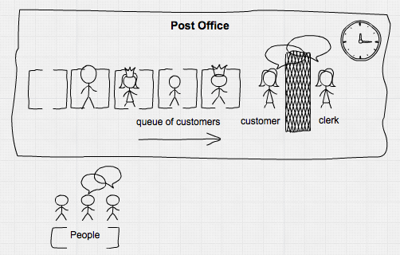
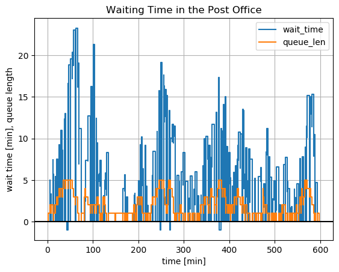

# Post Office

There is a small post office with one clerk serving the arriving customers. Customers have differing wishes leading to different serving times, from 1 - 5 minutes. We have a little variation in serving times due to variation in customer habits and clerk performance. The arrival rate of customers is about 18 per hour, every 3.33 minutes or 3 minutes, 20 seconds on average. Our post office is small and customer patience is limited, so queue length is limited to 5 customers.

We have provided 10% extra capacity, so our expectation is that there should not be too many customers discouraged for long waiting times or for full queues.



Let's do a process-based simulation using `Simulate`. We need

1. a source: all the **people**, providing an unlimited supply for customers,
2. **customers** with their demands and their limited patience,
3. a **queue** and
4. our good old **clerk**.

First we must load the needed modules, describe a customer and define some helper functions:


```julia
using Simulate, Random, Distributions, DataFrames

mutable struct Customer
    id::Int64
    arrival::Float64
    request::Int64

    Customer(n::Int64, arrival::Float64) = new(n, arrival, rand(DiscreteUniform(1, 5)))
end

full(q::Channel) = length(q.data) >= q.sz_max
logevent(nr, queue::Channel, info::AbstractString, wt::Number) =
    push!(df, (round(τ(), digits=2), nr, length(queue.data), info, wt))
```
logevent (generic function with 1 method)


Then we define functions for our processes: people and clerk.


```julia
function people(output::Channel, β::Float64)
    i = 1
    while true
        Δt = rand(Exponential(β))
        delay!(Δt)
        if !full(output)
            put!(output, Customer(i, τ()))
            logevent(i, output, "enqueues", 0)
         else
            logevent(i, output, "leaves - queue is full!", -1)
        end
        i += 1
    end
end

function clerk(input::Channel)
    cust = take!(input)
    Δt = cust.request + randn()*0.2
    logevent(cust.id, input, "now being served", τ() - cust.arrival)
    delay!(Δt)
    logevent(cust.id, input, "leaves", τ() - cust.arrival)
end
```
clerk (generic function with 1 method)


Then we have to create a logging table, register and startup the processes:


```julia
reset!(𝐶)  # for repeated runs it is easier if we reset our central clock here
Random.seed!(2019)  # seed random number generator for reproducibility
queue = Channel(5)  # thus we determine the max size of the queue

df = DataFrame(time=Float64[], cust=Int[], qlen=Int64[], status=String[], wtime=Float64[])

process!(𝐶, SimProcess(1, people, queue, 3.333)) # register the functions as processes
process!(𝐶, SimProcess(2, clerk, queue))
```
2


Then we can simply run the simulation. We assume our time unit being minutes, so we run for 600 units:


```julia
println(run!(𝐶, 600))
println("``(length(queue.data)) customers yet in queue")
```
run! finished with 338 clock events, 0 sample steps, simulation time: 600.0\
0 customers yet in queue

Our table has registered it all:

```julia
df
```

| no  | time | cust | qlen | status | wtime |
|---|-----|---:|---:|----------|-----|
| 1 | 1.2 | 1 | 1 | enqueues | 0.0 |
| 2 | 1.2 | 1 | 0 | now being served | 0.0 |
| 3 | 5.46 | 2 | 1 | enqueues | 0.0 |
| 4 | 5.5 | 3 | 2 | enqueues | 0.0 |
| 5 | 6.19 | 1 | 2 | leaves | 4.99532 |
| 6 | 6.19 | 2 | 1 | now being served | 0.737497 |
| 7 | 7.99 | 4 | 2 | enqueues | 0.0 |
| 8 | 8.81 | 2 | 2 | leaves | 3.35581 |
| 9 | 8.81 | 3 | 1 | now being served | 3.30971 |
| 10 | 12.33 | 5 | 2 | enqueues | 0.0 |
| 11 | 12.98 | 3 | 2 | leaves | 7.4733 |
| 12 | 12.98 | 4 | 1 | now being served | 4.98585 |
| 13 | 13.73 | 4 | 1 | leaves | 5.74268 |
| 14 | 13.73 | 5 | 0 | now being served | 1.39837 |
| 15 | 15.72 | 6 | 1 | enqueues | 0.0 |
| 16 | 17.12 | 7 | 2 | enqueues | 0.0 |
| 17 | 17.73 | 5 | 2 | leaves | 5.3967 |
| 18 | 17.73 | 6 | 1 | now being served | 2.00988 |
| 19 | 20.0 | 8 | 2 | enqueues | 0.0 |
| 20 | 20.76 | 9 | 3 | enqueues | 0.0 |
| 21 | 23.26 | 6 | 3 | leaves | 7.53774 |
| 22 | 23.26 | 7 | 2 | now being served | 6.13554 |
| 23 | 25.43 | 10 | 3 | enqueues | 0.0 |
| 24 | 26.0 | 11 | 4 | enqueues | 0.0 |
| 25 | 26.35 | 7 | 4 | leaves | 9.22525 |
| 26 | 26.35 | 8 | 3 | now being served | 6.34474 |
| 27 | 27.49 | 12 | 4 | enqueues | 0.0 |
| 28 | 27.64 | 8 | 4 | leaves | 7.63665 |
| 29 | 27.64 | 9 | 3 | now being served | 6.88549 |
| 30 | 29.06 | 13 | 4 | enqueues | 0.0 |


```julia
last(df, 5)
```

| no | time    | cust  | qlen  | status           | wtime   |
|----|---------|------:|------:| -----------------|---------|
| 1  | 589.1   | 171   | 1     | enqueues         | 0.0     |
| 2  | 589.1   | 171   | 0     | now being served | 0.0     |
| 3  | 593.77  | 171   | 0     | leaves           | 4.67801 |
| 4  | 598.01  | 172   | 1     | enqueues         | 0.0     |
| 5  | 598.01  | 172   | 0     | now being served | 0.0     |

```julia
describe(df[df[!, :wtime] .> 0, :wtime])
```

    Summary Stats:
    Length:         302
    Missing Count:  0
    Mean:           7.486712
    Minimum:        0.009196
    1st Quartile:   3.866847
    Median:         6.409644
    3rd Quartile:   10.541481
    Maximum:        23.268310
    Type:           Float64


In ``600`` minutes simulation time, we registered ``172`` customers and ``505`` status changes. The mean and median waiting times were around ``7`` minutes.


```julia
by(df, :status, df -> size(df, 1))
```
| no | status | x1 |
|---|-----|---:|
|1 | enqueues | 167 |
|2 | now being served | 167 |
|3 | leaves | 166 |
|4 | leaves - queue is full! | 5 |

Of the ``172`` customers, ``167`` of them participated in the whole process and were served, but ``5`` left beforehand because the queue was full:

```julia
df[df.wtime .< 0,:]
```
| no | time | cust | qlen | status | wtime |
|---|-----|---:|---:|----------|-----|
|1 | 45.32 | 19 | 5 | leaves - queue is full! | -1.0 |
|2 | 249.11 | 66 | 5 | leaves - queue is full! | -1.0 |
|3 | 270.04 | 74 | 5 | leaves - queue is full! | -1.0 |
|4 | 380.39 | 106 | 5 | leaves - queue is full! | -1.0 |
|5 | 382.02 | 107 | 5 | leaves - queue is full! | -1.0 |


```julia
using PyPlot
step(df.time, df.wtime)
step(df.time, df.qlen)
axhline(y=0, color="k")
grid()
xlabel("time [min]")
ylabel("wait time [min], queue length")
title("Waiting Time in the Post Office")
legend(["wait_time", "queue_len"]);
```





Many customers had waiting times of more than 10, 15 up to even more than 20 minutes. The negative waiting times were the 5 customers, which left because the queue was full.

So many customers will remain angry. If this is the situation all days, our post office will have an evil reputation. What should we do?

## Conclusion

Even if our process runs within predetermined bounds (queue length, customer wishes …), it seems to fluctuate wildly and to produce unpredicted effects. This is due to variation in arrivals, in demands and in serving time on system performance. In this case 10% extra capacity is not enough to provide enough buffer for variation and for customer service – even if our post clerk is the most willing person.

Even for such a simple everyday system, we cannot say beforehand – without reality check – which throughput, waiting times, mean queue length, capacity utilization or customer satisfaction will emerge. Even more so for more complicated systems in production, service, projects and supply chains with multiple dependencies.

If we had known the situation beforehand, we could have provided standby for our clerk or install an automatic stamp dispenser for cutting shorter tasks … We should have done a simulation before …
