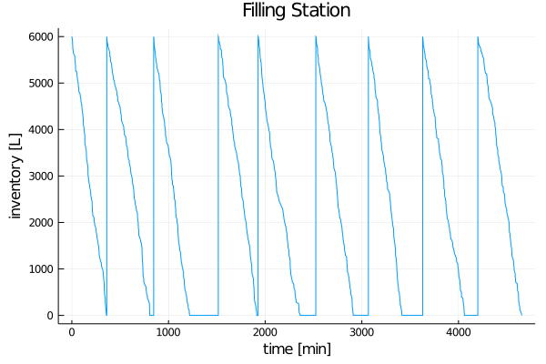

# Introduction

```@meta
CurrentModule = DiscreteEvents
```

`DiscreteEvents.jl` allows you to

1. setup virtual or realtime clocks,
2. schedule events (Julia functions or expressions) to them,
3. run clocks to trigger events.

## Preparations

`DiscreteEvents.jl` is a registered package. You install it to your Julia environment with

```julia-repl
] add DiscreteEvents
```

You can install the development version with

```julia-repl
] add https://github.com/pbayer/DiscreteEvents.jl
```

You can then load it with

```@repl intro
using DiscreteEvents
```

## Setup a clock

Setting up a virtual clock is as easy as

```@repl intro
clock = Clock()
```

You created a [`Clock`](@ref) variable `clk` with a clock at thread 1 with pretty much everything set to 0, without yet any scheduled events (ev), conditional events (cev) or sampling events (sampl).

You can now schedule events to your clock. In order to demonstrate how it works we setup a small simulation. 

## Inventory Control Problem

An inflammable is stored in a special tank at a filling station. Customers arrive according to a Poisson process with rate ``λ`` and ask for an amount ``\,X \sim \mathcal{N}(μ, σ^2)\,|\, a<X\,`` of the product. Any demand that cannot be met is lost. Opportunities to replenish the stock in the tank occur according to a Poisson process with rate ``ρ``. The two Poisson processes are assumed to be independent of each other. For security reasons replenishment is only allowed when the tank is empty. At those opportunities it is replenished with a fixed amount ``Q``. [^1]

We are interested to study the stock in the tank and the fraction of demand that is lost.

First we setup a data structure for a simulation:

```julia
using DiscreteEvents, Distributions, Random

mutable struct Station
    q::Float64           # fuel amount
    t::Vector{Float64}   # time vector
    qt::Vector{Float64}  # fuel/time vector
    cs::Int              # customers served
    cl::Int              # customers lost
    qs::Float64          # fuel sold
    ql::Float64          # lost sales
end
```

We have two events: `customer` and `replenishment` happening in two interacting Poisson processes:

```julia
function customer(c::Clock, s::Station, X::Distribution)
    function fuel(s::Station, x::Float64)
        s.q -= x             # take x from tank
        push!(s.t, c.time)   # record time, amount, customer, sale
        push!(s.qt, s.q)
        s.cs += 1            
        s.qs += x
    end

    x = rand(X)              # calculate demand
    if s.q ≥ x               # demand can be met
        fuel(s, x)
    elseif s.q ≥ a           # only partially in stock
        s.ql += x - s.q      # count the loss
        fuel(s, s.q)         # give em all we have
    else
        s.cl += 1            # count the lost customer
        s.ql += x            # count the lost demand
    end
end

function replenish(c::Clock, s::Station, Q::Float64)
    if s.q < a
        push!(s.t, c.time)
        push!(s.qt, s.q)
        s.q += Q
        push!(s.t, c.time)
        push!(s.qt, s.q)
    end
end
```

We pass our event functions a [`Clock`](@ref) variable in order to access the clock's `c.time`.

Now we setup our constants and variables, wrap the functions in [`fun`](@ref) and schedule them as [`event!`](@ref event!(::CL,::A,::U)  where {CL<:AbstractClock,A<:Action,U<:Number})s and [`run!`](@ref) the clock for 5000 virtual minutes:

```julia
Random.seed(123)
const λ = 0.5      # ~ every two minutes a customer
const ρ = 1/180    # ~ every 3 hours a replenishment truck
const μ = 30       # ~ mean demand per customer 
const σ = 10       #   standard deviation
const a = 5        #   minimum amount 
const Q = 6000.0   # replenishment amount
const M₁ = Exponential(1/λ)  # customer arrival time distribution
const M₂ = Exponential(1/ρ)  # replenishment time distribution
const X = TruncatedNormal(μ, σ, a, Inf)  # demand distribution

clock = Clock()    # create a clock, a fuel station and events
s = Station(Q, Float64[0.0], Float64[Q], 0, 0, 0.0, 0.0)
event!(clock, fun(replenish, clock, s, Q), every, M₂)
event!(clock, fun(customer, clock, s, X), every, M₁)
println(run!(clock, 5000))   # run the clock

@show fuel_sold = s.qs;
@show loss_rate = s.ql/s.qs;
@show served_customers = s.cs;
@show lost_customers = s.cl;
```

```julia
run! finished with 2525 clock events, 0 sample steps, simulation time: 5000.0
fuel_sold = s.qs = 53999.999999999956
loss_rate = s.ql / s.qs = 0.3962195131252451
served_customers = s.cs = 1789
lost_customers = s.cl = 708
```

We sold 9 tanks of fuel to 1789 customers. But we could have served 708 more customers and sell nearly 40% more fuel. Clearly we have some improvement potential:

```julia
using Plots
plot(s.t, s.qt, title="Filling Station", xlabel="time [min]", ylabel="inventory [L]", legend=false)
savefig("invctrl.png")
```



If we could manage to replenish immediately after the tank is empty, we would be much better off.

## A-B Call Center Problem

`DiscreteEvents` also provides process-based simulation. A process is a typical sequence of events. This is particularly useful if we can describe our system in such terms.

One example is a call center with two servers, Able and Baker and a line for incoming calls. Able is more experienced and can provide service faster than Baker. We have some assumptions about arrival and service time distributions. We want to know if the system works and how long customers have to wait [^2].

First we describe some data structures for our system:

```julia
using DiscreteEvents, Distributions, Random

mutable struct Caller
    id::Int
    t₁::Float64  # arrival time
    t₂::Float64  # beginning of service time
    t₃::Float64  # end of servive time
end

mutable struct Server
    id::Int
    S::Distribution  # service time distribution
    tbusy::Float64   # cumulative service time
end
```

We describe the processes in our system as two functions `serve` and `arrive`:

```julia
function serve(c::Clock, s::Server, input::Channel, output::Vector{Caller}, limit::Int)
    call = take!(input)           # take a call
    call.t₂ = c.time              # record the beginning of service time
    delay!(c, s.S)                # delay for service time
    call.t₃ = c.time              # record the end of service time 
    s.tbusy += call.t₃ - call.t₂  # log service time
    push!(output, call)           # hang up
    call.id ≥ limit && stop!(c)
end

function arrive(c::Clock, input::Channel, count::Vector{Int})
    count[1] += 1
    put!(input, Caller(count[1], c.time, 0.0, 0.0))
end
```

We implement our caller queue as a `Channel` eventually blocking a process if it calls `take!`. The `serve` function calls a [`delay!`](@ref) from the [`Clock`](@ref). This suspends a process for the required simulation time. Note that the `serve` process [`stop!`](@ref)s the clock after the last caller is finished.

Next we initialize our constants, setup a simulation environment, wrap our servers in [`Prc`](@ref) and start them as [`process!`](@ref)es. The arrivals are an event-based Poisson process as in the first example [^3]. We [`run!`](@ref) the clock for enough time:

```julia
Random.seed!(123)
const N = 1000
const M_arr = Exponential(2.5)
const M_a   = Exponential(3)
const M_b   = Exponential(4)

clock = Clock()
input = Channel{Caller}(Inf)
output = Caller[]
s1 = Server(1, M_a, 0.0)
s2 = Server(2, M_b, 0.0)
process!(clock, Prc(1, serve, s1, input, output, N))
process!(clock, Prc(2, serve, s2, input, output, N))
event!(clock, fun(arrive, clock, input, count), every, M_arr)
run!(clock, 5000)
```

```julia
"run! halted with 2005 clock events, 0 sample steps, simulation time: 2464.01"
```

The clock stopped at 2464. We served 1000 callers in 2464 minutes. This is an average lead time of 2.5 min. Doesn't seem so bad.

```julia
julia> s1.tbusy / clock.time
0.7256119737495218

julia> s2.tbusy / clock.time
0.7422549861860762
```

Also our servers have been busy only about 73% of the time. Could we give them some other work to do? How about waiting times for callers?

```julia
using Plots
wt = [c.t₂ - c.t₁ for c in output]
plot(wt, title="A-B-Call center ", xlabel="callers", ylabel="waiting time [min]", legend=false)
savefig("ccenter.png")
```


Given the average values, something unexpected emerges: The responsiveness of our call center is not good and waiting times often get way too long. If we want to shorten them, we must improve our service times or add more servers.

## Evaluation

It is easy to simulate discrete event systems such as stochastic processes or queueing systems with `DiscreteEvents`. It integrates well with Julia.

## Further examples

You can find more examples at [`DiscreteEventsCompanion`](https://pbayer.github.io/DiscreteEventsCompanion.jl/dev/examples/examples/).

[^1]: This is a modified version of example 4.1.1 in Tijms: A First Course in Stochastic Models, Wiley 2003, p 143ff
[^2]: This is a simplified version of the Able-Baker Call Center Problem in Banks, Carson, Nelson, Nicol: Discrete-Event System Simulation, Pearson 2005, p 35 ff
[^3]: The different approaches to modeling: event-based and process-based can be combined.