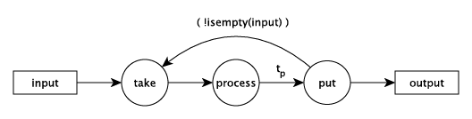
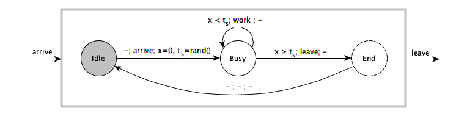
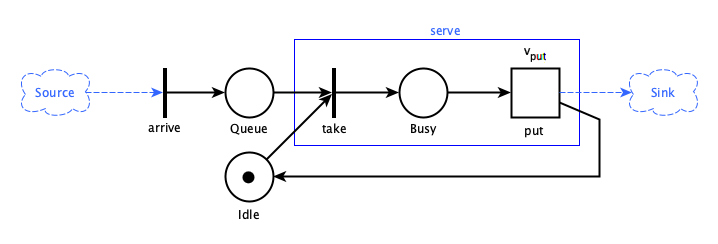

# Approaches to modeling and simulation

`Simulate.jl` supports different approaches to modeling and simulation of *discrete event systems (DES)*. It provides three major schemes: 1) an [event-scheduling scheme](@ref event_scheme), 2) a [process-oriented scheme](@ref process_scheme) and 3) [continuous sampling](@ref continuous_sampling). With them different modeling strategies can be applied.

A problem can be expressed differently through various modeling approaches. A simple problem can illustrate this :

> A server *takes* something from an input, *processes* it for some time and
> *puts* it out to an output. There are 8 servers in the system, 4 foos and 4 bars
> interacting with each other via two channels.


## Event based modeling

In this view *events* occur in time and trigger further events. Here the three server actions are seen as events and can be described in an event graph:



You define a data structure for the server, provide functions for the three actions, create channels and servers and start:

```julia
using Simulate, Printf, Random

mutable struct Server
  id::Int64
  name::AbstractString
  input::Channel
  output::Channel
  op     # operation to take
  token  # current token

  Server(id, name, input, output, op) = new(id, name, input, output, op, nothing)
end

function take(S::Server)
    if isready(S.input)
        S.token = take!(S.input)
        @printf("%5.2f: %s %d took token %d\n", tau(), S.name, S.id, S.token)
        event!(Fun(put, S), after, rand())         # call put after some time
    else
        event!(Fun(take, S), Fun(isready, S.input)) # call again if input is ready
    end
end

function put(S::Server)
    put!(S.output, S.op(S.id, S.token))
    S.token = nothing
    take(S)
end

reset!(𝐶)
Random.seed!(123)

ch1 = Channel(32)  # create two channels
ch2 = Channel(32)

s = shuffle(1:8)
for i in 1:2:8
    take(Server(s[i], "foo", ch1, ch2, +))
    take(Server(s[i+1], "bar", ch2, ch1, *))
end

put!(ch1, 1) # put first token into channel 1

run!(𝐶, 10)
```

```julia
julia> include("docs/examples/channels1.jl")
 0.01: foo 4 took token 1
 0.12: bar 6 took token 5
 0.29: foo 1 took token 30
 0.77: bar 8 took token 31
 1.64: foo 2 took token 248
 2.26: bar 3 took token 250
...
 6.70: bar 5 took token 545653
 6.91: foo 4 took token 2728265
 7.83: bar 6 took token 2728269
 8.45: foo 1 took token 16369614
 9.26: bar 8 took token 16369615
 9.82: foo 2 took token 130956920
"run! finished with 20 clock events, simulation time: 10.0"
```
**see:** [`tau`](@ref), [`event!`](@ref), [`Fun`](@ref), [`reset!`](@ref), [`𝐶`](@ref), [`run!`](@ref)

## State based modeling

Here the server has three states: *Idle*, *Busy* and *End* (where *End* does nothing). On an arrival event it resets its internal clock ``x=0`` and determines the service time ``t_s``, moves to *Busy*, *works* on its input and puts it out when ``t_s`` is over. Then it goes back to *Idle*. A state transition diagram (Mealy model) of the timed automaton would look like:



Again you need a data structure for the server (state …). You define states and events and implement a `δ` transition function with two methods. Thereby you dispatch on states and events. Since you don't need to implement all combinations of states and events, you may implement a fallback transition.

```julia
using Simulate, Printf, Random

abstract type Q end  # states
struct Idle <: Q end
struct Busy <: Q end
abstract type Σ end  # events
struct Arrive <: Σ end
struct Leave <: Σ end

mutable struct Server
    id::Int64
    name::AbstractString
    input::Channel
    output::Channel
    op     # operation to take
    state::Q
    token  # current token

    Server(id, name, input, output, op) = new(id, name, input, output, op, Idle(), nothing)
end

arrive(A) = event!(Fun(δ, A, A.state, Arrive()), Fun(isready, A.input))

function δ(A::Server, ::Idle, ::Arrive)
    A.token = take!(A.input)
    @printf("%5.2f: %s %d took token %d\n", tau(), A.name, A.id, A.token)
    A.state=Busy()
    event!(Fun(δ, A, A.state, Leave()), after, rand())
end

function δ(A::Server, ::Busy, ::Leave)
    put!(A.output, A.op(A.id,A.token))
    A.state=Idle()
    arrive(A)
end

δ(A::Server, q::Q, σ::Σ) =               # fallback transition
        println(stderr, "$(A.name) $(A.id) undefined transition $q, $σ")

reset!(𝐶)
Random.seed!(123)

ch1 = Channel(32)  # create two channels
ch2 = Channel(32)

s = shuffle(1:8)
for i in 1:2:8
    arrive(Server(s[i], "foo", ch1, ch2, +))
    arrive(Server(s[i+1], "bar", ch2, ch1, *))
end

put!(ch1, 1) # put first token into channel 1

run!(𝐶, 10)
```

```julia
julia> include("docs/examples/channels2.jl")
 0.01: foo 4 took token 1
 0.12: bar 6 took token 5
 0.29: foo 1 took token 30
 0.77: bar 8 took token 31
 1.64: foo 2 took token 248
 2.26: bar 3 took token 250
 ...
 6.70: bar 5 took token 545653
 6.91: foo 4 took token 2728265
 7.83: bar 6 took token 2728269
 8.45: foo 1 took token 16369614
 9.26: bar 8 took token 16369615
 9.82: foo 2 took token 130956920
"run! finished with 20 clock events, simulation time: 10.0"
```
**see:** [`tau`](@ref), [`event!`](@ref), [`Fun`](@ref), [`reset!`](@ref), [`𝐶`](@ref), [`run!`](@ref)

## Activity based modeling

The server's *activity* is the processing of the token. A timed Petri net would look like:



The *arrive* "transition" puts a "token" in the *Queue*. If both "places" *Idle* and *Queue* have tokens, the server *takes* them, shifts one to *Busy* and *puts* out two after a timed transition with delay ``v_{put}``. Then it is *Idle* again and the cycle restarts.

The server's activity is described by the blue box. Following the Petri net, you should implement a state variable with states Idle and Busy, but you don't need to if you separate the activities in time. You need a data structure for the server and define a function for the activity:

```julia
using Simulate, Printf, Random

mutable struct Server
  id::Int64
  name::AbstractString
  input::Channel
  output::Channel
  op     # operation
  token  # current token

  Server(id, name, input, output, op) = new(id, name, input, output, op, nothing)
end

arrive(S::Server) = event!(Fun(serve, S), Fun(isready, S.input))

function serve(S::Server)
    S.token = take!(S.input)
    @printf("%5.2f: %s %d took token %d\n", tau(), S.name, S.id, S.token)
    event!((Fun(put!, S.output, S.op(S.id, S.token)), Fun(arrive, S)), after, rand())
end

reset!(𝐶)
Random.seed!(123)

ch1 = Channel(32)  # create two channels
ch2 = Channel(32)

s = shuffle(1:8)
for i in 1:2:8
    arrive(Server(s[i], "foo", ch1, ch2, +))
    arrive(Server(s[i+1], "bar", ch2, ch1, *))
end

put!(ch1, 1) # put first token into channel 1

run!(𝐶, 10)
```

```julia
julia> include("docs/examples/channels3.jl")
 0.01: foo 4 took token 1
 0.12: bar 6 took token 5
 0.29: foo 1 took token 30
 0.77: bar 8 took token 31
 1.64: foo 2 took token 248
 2.26: bar 3 took token 250
 ...
 6.70: bar 5 took token 545653
 6.91: foo 4 took token 2728265
 7.83: bar 6 took token 2728269
 8.45: foo 1 took token 16369614
 9.26: bar 8 took token 16369615
 9.82: foo 2 took token 130956920
"run! finished with 20 clock events, simulation time: 10.0"
```
**see:** [`tau`](@ref), [`event!`](@ref), [`Fun`](@ref), [`reset!`](@ref), [`𝐶`](@ref), [`run!`](@ref)

## Process based modeling

Here you combine it all in a simple function of *take!*-*delay!*-*put!* like in the activity based example, but running in the loop of a process. Processes can wait or delay and are suspended and reactivated by Julia's scheduler according to background events. There is no need to handle events explicitly and no need for a server data type since a process keeps its own data. Processes must look careful to their timing and therefore you must enclose the IO-operation in a [`now!`](@ref) call:

```julia
function simple(input::Channel, output::Channel, name, id, op)
    token = take!(input)         # take something, eventually wait for it
    now!(Fun(println, @sprintf("%5.2f: %s %d took token %d", tau(), name, id, token)))
    d = delay!(rand())           # wait for a given time
    put!(output, op(token, id))  # put something else out, eventually wait
end

ch1 = Channel(32)  # create two channels
ch2 = Channel(32)

for i in 1:2:8    # create and register 8 Prces
    process!(Prc(i, simple, ch1, ch2, "foo", i, +))
    process!(Prc(i+1, simple, ch2, ch1, "bar", i+1, *))
end

reset!(𝐶)
put!(ch1, 1) # put first token into channel 1
run!(𝐶, 10)
```

```julia
julia> include("docs/examples/channels4.jl")
 0.00: foo 7 took token 1
 0.77: bar 4 took token 8
 1.71: foo 3 took token 32
 2.38: bar 2 took token 35
 2.78: foo 5 took token 70
 3.09: bar 8 took token 75
 ...
 7.64: foo 7 took token 1387926
 7.91: bar 4 took token 1387933
 8.36: foo 3 took token 5551732
 8.94: bar 2 took token 5551735
 9.20: foo 5 took token 11103470
 9.91: bar 8 took token 11103475
"run! finished with 21 clock events, simulation time: 10.0"
```
**see:** [`now!`](@ref), [`Fun`](@ref), [`tau`](@ref), [`delay!`](@ref), [`process!`](@ref), [`Prc`](@ref), [`reset!`](@ref), [`run!`](@ref), [`𝐶`](@ref)


## Comparison

The output of the last example is different from the first three approaches because we did not shuffle (the shuffling of the processes is done by the scheduler). So if the output depends very much on the sequence of events and you need to have reproducible results, explicitly controlling for the events like in the first three examples is preferable. If you are more interested in statistical evaluation - which is often the case -, the 4th approach is appropriate.

All four approaches can be expressed in `Simulate.jl`. Process based modeling seems to be the simplest and the most intuitive approach, while the first three are more complicated. But they are also more structured and controllable , which comes in handy for more complicated examples. After all, parallel processes are often tricky to control and to debug. But you can combine the approaches and take the best from all worlds.

## Combined approach

Physical systems can be modeled as *continuous systems* (nature does not jump), *discrete systems* (nature jumps here!) or *hybrid systems* (nature jumps sometimes).

While continuous systems are the domain of differential equations, discrete and hybrid systems may be modeled easier with `Simulate.jl` by combining the *event-scheduling*, the *process-based* and the *continuous-sampling* schemes.

### A hybrid system

In a hybrid system we have continuous processes and discrete events interacting in one system. A thermostat or a house heating system is a basic example of this:

- Heating changes between two states: On and Off. The thermostat switches heating on if romm temperature `Tr` is greater or equal 23°C, it switches off if temperature falls below 20°C.
- A room cools at a rate proportional to the difference between room temperature `Tr` and environment temperature `Te`.
- It heats at a rate proportional to the temperature difference between temperature of the heating fluid `Th` and room temperature `Tr`.
- The room temperature `Tr` changes proportional to the difference between heating and cooling.

First we setup the physical model with some assumptions:


```julia
using Simulate, Plots, DataFrames, Random, Distributions, LaTeXStrings

const Th = 40     # temperature of heating fluid
const R = 1e-6    # thermal resistance of room insulation
const α = 2e6     # represents thermal conductivity and capacity of the air
const β = 3e-7    # represents mass of the air and heat capacity
η = 1.0           # efficiency factor reducing R if doors or windows are open
heating = false   # initially the heating is off

Δte(t, t1, t2) = cos((t-10)*π/12) * (t2-t1)/2  # change rate of a sinusoidal Te

function Δtr(Tr, Te, heating)
    Δqc = (Tr - Te)/(R * η)             # cooling rate
    Δqh = heating ? α * (Th - Tr) : 0   # heating rate
    return β * (Δqh - Δqc)              # change of room temperature
end
```
Δtr (generic function with 1 method)

We setup a simulation for 24 hours from 0am to 12am. We update the simulation every virtual minute.


```julia
reset!(𝐶)                               # reset the clock
rng = MersenneTwister(122)              # set random number generator
Δt = 1//60                              # evaluate every minute
Te = 11                                 # starting values
Tr = 20
df = DataFrame(t=Float64[], tr=Float64[], te=Float64[], heating=Int64[])

function setTemperatures(t1=8, t2=20)   # define a sampling function
    global Te += Δte(tau(), t1, t2) * 2π/1440 + rand(rng, Normal(0, 0.1))
    global Tr += Δtr(Tr, Te, heating) * Δt
    push!(df, (tau(), Tr, Te, Int(heating)) )
end

function switch(t1=20, t2=23)           # a function simulating the thermostat
    if Tr ≥ t2
        global heating = false
        event!(Fun(switch, t1, t2), @val :Tr :≤ t1)  # setup a conditional event
    elseif Tr ≤ t1
        global heating = true
        event!(Fun(switch, t1, t2), @val :Tr :≥ t2)  # setup a conditional event
    end
end

periodic!(Fun(setTemperatures), Δt)        # setup the sampling function
switch()                                   # start the thermostat

@time run!(𝐶, 24)                          # run the simulation
```
0.040105 seconds (89.21 k allocations: 3.435 MiB)\
"run! finished with 0 clock events, 1440 sample steps, simulation time: 24.0"

```julia
plot(df.t, df.tr, legend=:bottomright, label=L"T_r")
plot!(df.t, df.te, label=L"T_e")
plot!(df.t, df.heating, label="heating")
xlabel!("hours")
ylabel!("temperature")
title!("House heating undisturbed")
```


Now we have people entering the room or opening windows and thus reducing thermal resistance:


```julia
function people()
    delay!(6 + rand(Normal(0, 0.5)))         # sleep until around 6am
    sleeptime = 22 + rand(Normal(0, 0.5))    # calculate bed time
    while tau() < sleeptime
        global η = rand()                    # open door or window
        delay!(0.1 * rand(Normal(1, 0.3)))   # for some time
        global η = 1.0                       # close it again
        delay!(rand())                       # do something else
    end
end

reset!(𝐶)
rng = MersenneTwister(122)
Random.seed!(1234)
Te = 11
Tr = 20
df = DataFrame(t=Float64[], tr=Float64[], te=Float64[], heating=Int64[])

for i in 1:2                                 # put 2 people in the house
    process!(Prc(i, people), 1)               # run process only once
end
periodic!(Fun(setTemperatures), Δt)    # setup sampling
switch()                                     # start the thermostat

@time run!(𝐶, 24)
```
0.114938 seconds (72.52 k allocations: 2.320 MiB)\
"run! finished with 116 clock events, 1440 sample steps, simulation time: 24.0"


```julia
plot(df.t, df.tr, legend=:bottomright, label=L"T_r")
plot!(df.t, df.te, label=L"T_e")
plot!(df.t, df.heating, label="heating")
xlabel!("hours")
ylabel!("temperature")
title!("House heating with people")
```


We have now all major schemes: events, continuous sampling and processes combined in one example.

**see:** [`tau`](@ref), [`Fun`](@ref), [`event!`](@ref), [`delay!`](@ref), [`periodic!`](@ref), [`run!`](@ref), [`process!`](@ref), [`Prc`](@ref), [`reset!`](@ref), [`𝐶`](@ref)\
**see also**: the [full house heating example](../examples/house_heating/house_heating.md) for further explanations.

## Theories

There are some theories about the different approaches (1) event based, (2) state based, (3) activity based and (4) process based. Choi and Kang [^1] have written an entire book about the first three approaches. Basically they can be converted to each other. Cassandras and Lafortune [^2] call those "the event scheduling scheme" and the 4th approach "the process-oriented simulation scheme" [^3]. There are communities behind the various views and `Simulate.jl` wants to be useful for them all.

[^1]:  [Choi and Kang: *Modeling and Simulation of Discrete-Event Systems*, Wiley, 2013](https://books.google.com/books?id=0QpwAAAAQBAJ)
[^2]:  [Cassandras and Lafortune: *Introduction to Discrete Event Systems*, Springer, 2008, Ch. 10](https://books.google.com/books?id=AxguNHDtO7MC)
[^3]: to be fair, the 4th approach is called by Choi and Kang "parallel simulation".
